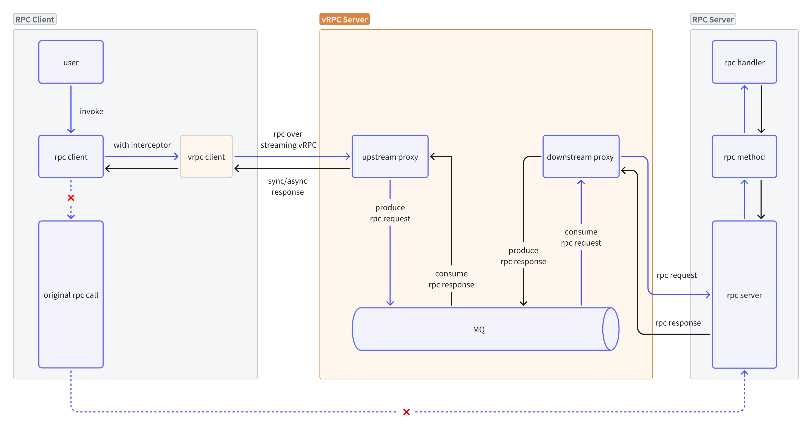

# vRPC - Virtual RPC Middleware

vRPC是一个中间件，通过消息队列将同步RPC调用转换为异步调用。它可以在调度系统和物联网云边缘架构等分布式系统中进行通信，而无需修改服务器端RPC实现。

## 特性

- **透明代理**: 通过实现业务RPC Over vRPC从而实现RPC流量代理，暂时只支持TCP协议
- **Go-Zero集成**: vRPC服务使用Go-Zero实现，并且服务端只负责流量转发，类似7层代理
- **插件系统**: vRPC服务后续可通过服务端插件扩展协议理解等网关功能
- **Protobuf通信**: vRPC的客户端和服务端使用Protobuf通信
- **消息队列**: 来自vRPC客户端的请求会被放入MQ中
- **多框架支持**: vRPC的客户端本身使用Go-Zero实现，但是支持被多种RPC框架集成
- **可扩展MQ**: 具备插件系统，vRPC默认使用Kafka，但也支持扩展使用其它MQ

## 架构



## 快速开始

### 安装

```bash
go get github.com/nextpkg/vrpc
```

### 基本使用

#### 1. 服务端

```go
package main

import (
    "github.com/nextpkg/vrpc"
    "github.com/nextpkg/vrpc/vserver"
    "github.com/nextpkg/vrpc/rpcbus"
)

func main() {
    config := &vrpc.Config{
        Name: "vrpc-server",
        Host: "0.0.0.0",
        Port: 8080,
        RpcBus: rpcbus.Config{
            Type:    "kafka",
            Brokers: []string{"localhost:9092"},
        },
        Topics: struct {
            Request  string `json:",default=vrpc.requests"`
            Response string `json:",default=vrpc.responses"`
        }{
            Request:  "vrpc.requests",
            Response: "vrpc.responses",
        },
        Targets: map[string]vrpc.Target{
            "demo": {
                Endpoint: "localhost:8081",
                Timeout:  "30s",
            },
        },
    }

    server, err := vserver.NewServer(config)
    if err != nil {
        panic(err)
    }

    server.Start()
}
```

#### 2. 客户端（推荐方式）

```go
package main

import (
    "context"
    "github.com/nextpkg/vrpc"
    "github.com/zeromicro/go-zero/zrpc"
    // "your-project/democlient" // 你的gRPC客户端
)

func main() {
    // 初始化vRPC客户端（可传入配置）
    vrpc.MustInitClient()
    defer vrpc.Close()

    // 初始化切面
    v := zrpc.WithUnaryClientInterceptor(vrpc.Interceptor())

    // 初始化客户端
    c := zrpc.MustNewClient(zrpc.RpcClientConf{}, v)

    // 发起RPC调用并返回结果
    // resp, err := democlient.NewDemo(c).Ping(ctx, &democlient.Request{})
}
```

#### 3. 客户端（直接调用方式）

```go
package main

import (
    "context"
    "github.com/nextpkg/vrpc"
)

func main() {
    // 初始化vRPC客户端
    vrpc.MustInitClient()
    defer vrpc.Close()

    // 获取客户端实例
    client := vrpc.GetClient()
    
    // 直接调用
    ctx := context.Background()
    requestData := []byte(`{"message": "Hello vRPC"}`)
    metadata := map[string]string{
        "user-id": "12345",
    }
    
    response, err := client.Call(ctx, "demo", "Ping", requestData, metadata)
    if err != nil {
        panic(err)
    }
    
    println("Response:", string(response.Payload))
}
```

## 配置

### 服务端配置

```yaml
# 服务配置
name: vrpc-server
host: 0.0.0.0
port: 8080

# gRPC服务配置
rpc_server_conf:
  listen_on: 0.0.0.0:9090

# MQ配置
rpc_bus:
  type: kafka
  brokers:
    - localhost:9092
  settings:
    compression: gzip
    batch_size: 100

# Topic配置
topics:
  request: vrpc.requests
  response: vrpc.responses

# 目标服务配置
targets:
  demo:
    endpoint: localhost:8081
    timeout: 30s
    settings:
      max_retries: 3

# 插件配置
plugins:
  - name: logger
    enabled: true
    settings:
      level: info
```

### 客户端配置

```yaml
# 客户端ID
client_id: demo-client

# MQ配置
rpc_bus:
  type: kafka
  brokers:
    - localhost:9092

# 超时配置
timeout:
  request: 30s
  connect: 5s

# 重试配置
retry:
  count: 3
  interval: 100ms

# Topic配置
topics:
  request: vrpc.requests
  response: vrpc.responses

# 调试开关
debug: true
```

## 项目结构

```
vrpc/
├── codec/              # 编解码器
├── config.go           # 配置定义
├── doc/               # 设计文档
├── example/           # 示例代码
├── internal/          # 内部实现
│   └── proto/         # Protobuf定义
├── rpcbus/            # 消息队列抽象层
├── vclient/           # 客户端实现
├── vserver/           # 服务端实现
├── vrpc.go            # 主入口
└── README.md
```

## 开发

### 生成Protobuf代码

```bash
cd internal/proto
protoc vrpc.proto --go_out=. --go-grpc_out=.
```

### 运行示例

```bash
# 启动Kafka（如果还没有运行）
docker run -d --name kafka -p 9092:9092 \
  -e KAFKA_ZOOKEEPER_CONNECT=zookeeper:2181 \
  -e KAFKA_ADVERTISED_LISTENERS=PLAINTEXT://localhost:9092 \
  confluentinc/cp-kafka:latest

# 运行示例
go run example/main.go
```

## 许可证

[LICENSE](LICENSE)