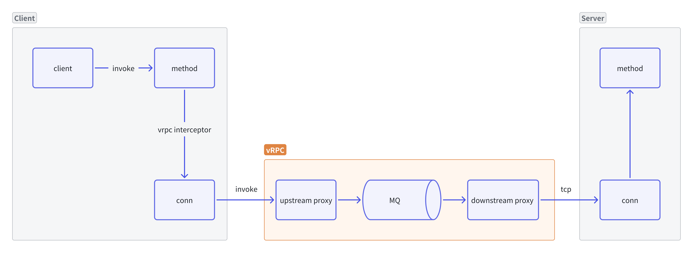

## Overview
vRPC是一个中间件，通过消息队列将同步RPC调用转换为异步调用。它可以在调度系统和物联网云边缘架构等分布式系统中进行通信，而无需修改服务器端RPC实现。

## Feature
- 基本原理
  - 通过实现业务RPC Over vRPC从而实现RPC流量代理，暂时只支持 TCP协议
  - vRPC 服务使用 Go-Zero 实现，并且服务端只负责流量转发，类似7层代理
  - vRPC 服务后续可通过服务端插件扩展协议理解等网关功能
- 通信
  - vRPC 的客户端（被业务集成）和vRPC服务端使用 Protobuf 通信
  - 来自 vRPC 客户端的请求会会被放入 MQ 中
- 可扩展性
  - vRPC 的客户端本身使用 Go-Zero 实现，但是支持被多种 RPC 框架集成，例如 Go-Zero，Go-Micro 等框架
  - 具备插件系统，vRPC默认使用 Kafka，但也支持扩展使用其它 MQ，例如 RocketMQ 等
  - 对于一般业务来说，只需要在业务的RPC 客户端稍微改造一个切面即可实现同步接口改异步接口

## Architecture


## Example
```go
// 初始化vRPC客户端（可传入配置）
vprc.MustInitClient()

// 初始化切面
v := zrpc.WithUnaryClientInterceptor(vprc.Interceptor)

// 初始化客户端
c := zrpc.MustNewClient(zrpc.RpcClientConf{}, v)

// 发起 RPC 调用并返回结果
resp, err := democlient.NewDemo(c).Ping(ctx, &democlient.Request{})
```
